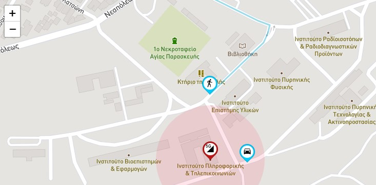
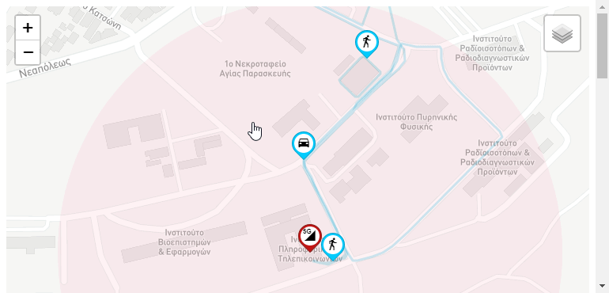

# leafletjs_examples
basic examples utilizing leafletjs

## static.html

Most basic example, provides code on how initialize a map and then add `markers`, `circle` and a `polyline` (path).

## demo.html

This example adds some more features:

 - `markers` that are updating their position (like moving on a predifined path)
 - grouping things together to `layers`

