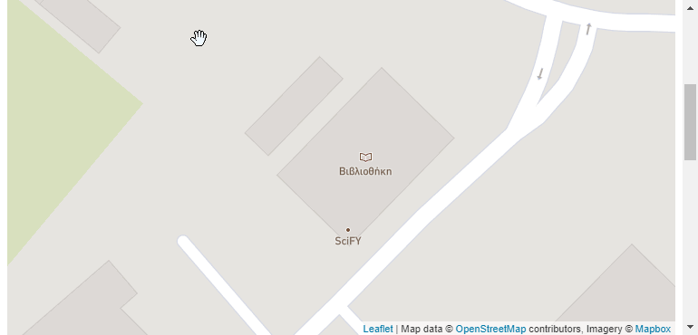
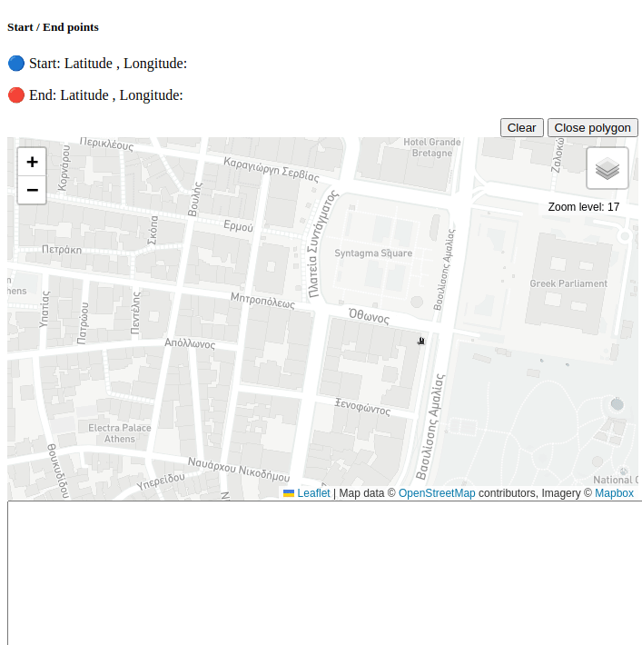

# leafletjs_examples
basic examples utilizing leafletjs.

> 💡 This repo was inspired by the **ETSI MEC Sandbox** which can be found at [try-mec.etsi.org](https://try-mec.etsi.org/).

## static.html

Most basic example, provides code on how to initialize a map and then add `markers`, `circle` and a `polyline` (path).

## demo.html

This example adds some more features:

 - `markers` that are updating their position (like moving on a predifined path)
 - grouping things together to `layers`

## generate_routes.html

This is a small tool that calculates (`latitude`,`longitude`) pairs. As the user keeps clicking on the map, the tool generates all the points that cover that distances (in straight lines) by using a `1-meter` step. With this approach, one can generate cyclic paths on the map and later add `markers` that move at `X` m/sec.

## generate_polygon_geojson.html

Similar to `generate_routes.html` but without the `1-meter` steps/points. Only the points clicked by the user are stored and when the button "close polygon" is pressed:

 - the very 1st point is pushed again to the list of existing points
 - a GeoJSON object is generated with the above points included
 - the polygon is renderend on the map with `L.geoJSON(...)`

